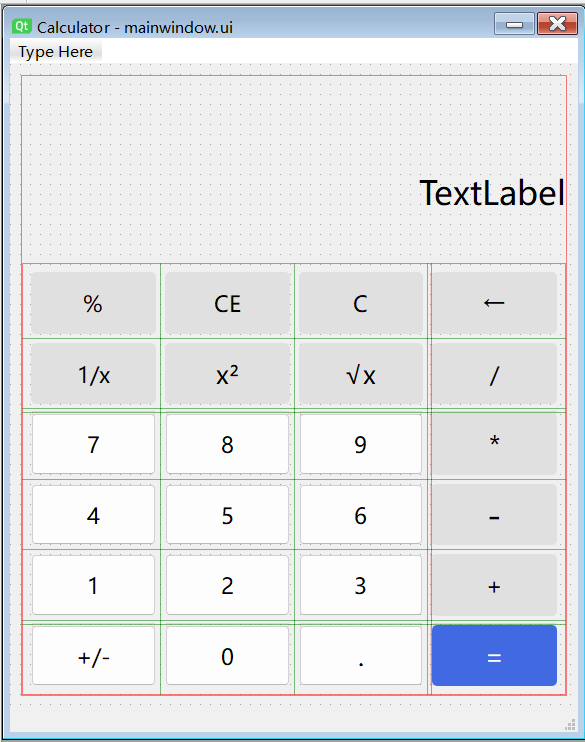
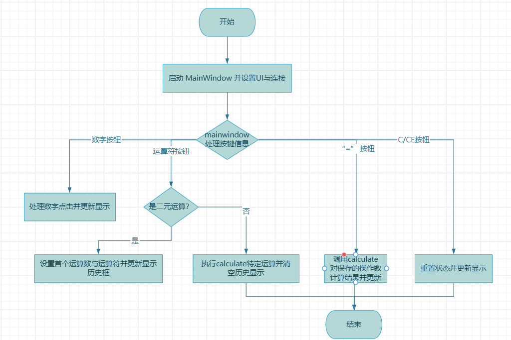
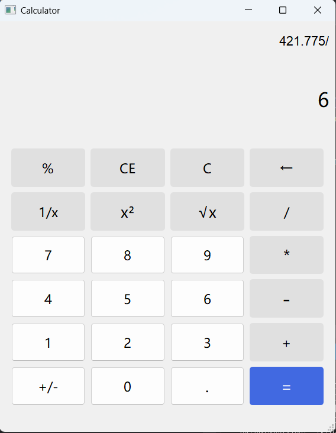

## 整体思路;
主窗口MainWindow类负责与页面文件进行交互，收集按键消息通过信号槽传递给calculate完成计算，calculate计算完成后再将结果通过信号槽传回MainWindow执行展示，不需要运算的操作如小数点z直接由MainWindow进行展示。 
## 界面设计：

用网格加垂直布局组合实现页面缩放时候保证控件正确显示，设置垂直布局控件比例为1:3:10保证各个空间界面大小合理，使用两个QLabel 分别展示历史运算与当前结果
## 类的设计思路  
MainWindow 负责界面与用户交互：在构造函数中通过 setupUi() 加载 Qt Designer 布局，在 InitConnections() 批量将数字键、运算符键和功能键与相应槽绑定；用 m_currentInput 保存当前输入字符串、用布m_opStatus 区分刚运算完是否要重置输入，从而智能地决定覆盖还是追加数字；所有运算调用都转给 Calculate，并将其 resultUpdate() 信号连接到 onResultUpdate() 槽以更新显示和清空历史。  
Calculate 只管计算，通过 setFirstCalNum() 和 setOperation() 接收首个操作数与运算类型，调用 calculate() 完成加减乘除并发射 resultUpdate() 通知 UI；还提供 percent()、reciprocal()、square()、sqrt()、numInverse() 等即时运算，reset() 则将内部状态清零，calculate只用QObject信号，便于未来扩展新算术函数,实现程序的低耦合。  
流程图：  

### Calculate类（计算）
```cpp
成员变量  
double m_firstCalNum：//存储第一个操作数  
Operation m_NextOp：//记录待执行的运算符 
enum Operation { None,Add,Subtract,Multiply,Divide,Percent,Square,Reciprocal,Sqrt,NumInverse}; //运算类型，根据输入运算符匹配执行函数  
核心函数
setFirstCalNum(double firstCalNum)：//接收并存储第一操作数  
setOperation(Operation::op)：//设置当前运算符  
double calculate(double secondCalNum)：//执行四则运算这类需要两个操作数的计算，给出resultUpdate（）信号 
percent(), square()... //执行各种函数运，抛出resultUpdate（）信号 
reset()：清空状态为初始  
信号  
resultUpdate(double result)：//任何运算完成后，都用此信号将结果推送给MainWindow,展示出来
信号连接:
connect(&m_calculate, &Calculate::resultUpdate, this, &MainWindow::onResultUpdate);
```

### MainWindow类（交互）
```cpp
成员变量
QString m_currentInput：//记录当前输入字符串
bool m_opStatus = true：//true的时候是输出就绪，false的时候是运算未完成
Calculate m_calculate：//完成计算
槽函数
onNumberClicked()//数字按钮槽函数
onOperatorClicked(Operation::op)：//将当前值提交给 Calculate 并切换运算符
onEqualClicked()：//触发calculate
onPercentClicked(), onSquareClicked()...//调用四则运算外的函数计算
onClearClicked(), onClearCEClicked(), onBackClicked()：//功能按钮
onResultUpdate(double result)：//接收结果并更新
信号连接：
所有按钮统一在 InitConnections() 中通过 connect() 绑定到对应槽
如：
connect(ui->m_btnAdd, &QPushButton::clicked, [this] { onOperatorClicked(Calculate::Add); });
connect(ui->m_btnReasult, &QPushButton::clicked, this, &MainWindow::onEqualClicked);
```
## 运行效果
